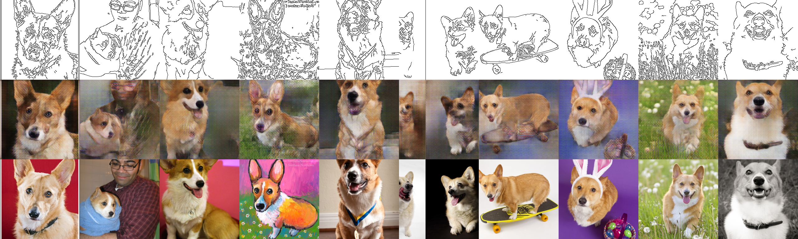
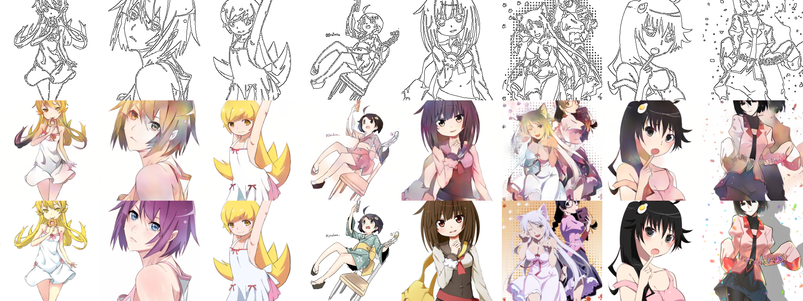
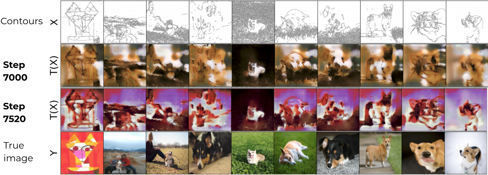

# Comparing pix2pix GAN and Neural Optimal Transport

The goal of the project is to implement pix2pix GAN model and Neural Optimal Transport using the same backbone (UNet with `base_width = 48`) and compare them on self-collected datasets of real-world images (Corgi dogs and anime).

## GAN

FID = 162.9

FID = 115.7

https://wandb.ai/xiyori/pix2pix_corgi_flickr

## NOT

FID = 357.5

FID = 241.8

https://wandb.ai/marina_shesha/CV_third_time

### Installation

To install necessary python packages run the command:

`pip install -r requirements.txt`

For more info on Neural Optimal Transport refer to `notebooks/CV_NOT_EXPS.ipynb`.

### Resources

Download all needed resources (data, checkpoints & predictions) with

`chmod +x bin/download.sh && ./bin/download.sh`

or use `bin/download_*.py` scripts for your own data collection with Flickr / Danbooru API.

### Training

Once the resources are ready, start the training with

`python3 train.py -c anime_super`

for supervised pretraining. Then use the obtained weights to traing GAN

`python3 train.py -c anime -pg <your weights>`

### Generating valid predictions

Use

`python3 predict.py -c anime -pg <your weights>`

to generate samples from the validation set.

The images are stored at `resources/predicted`.

### Calculating FID (optional)

Use

`python3 bin/prepare_fid.py -c anime`

to scale and crop the original images using the validation transform.

Install `pip install pytorch-fid` and compute fid like this:

`python3 -m pytorch_fid resources/corgi_flickr_fid/ resources/predicted/<your predicts>`

### General usage

Run `python3 some_script.py -h` for help.
